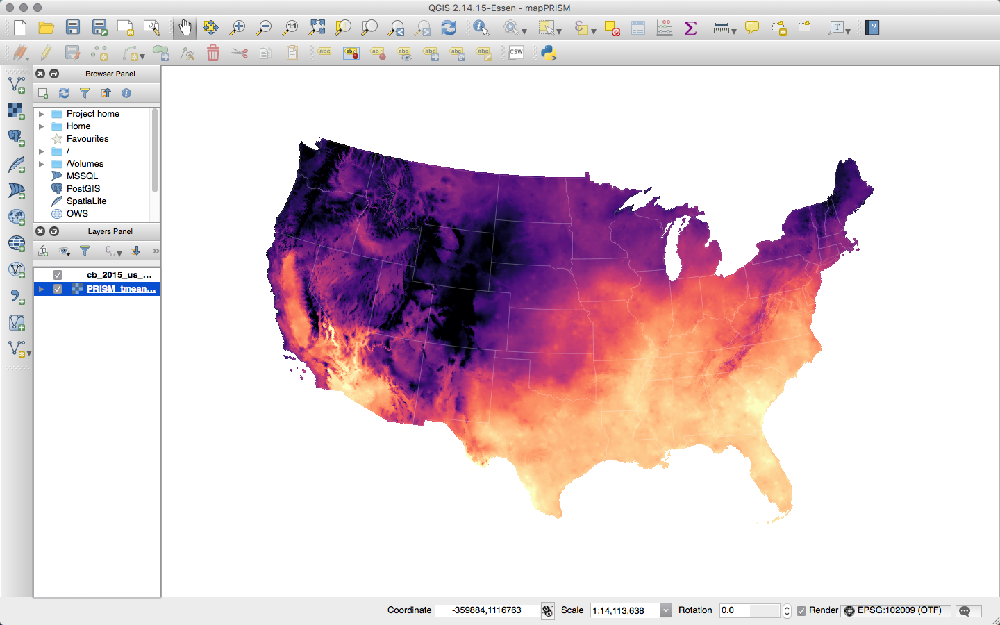

[<span class="fa-stack fa-4x">
  <i class="fa fa-folder fa-stack-2x"></i>
  <i class="fa fa-arrow-down fa-inverse fa-stack-1x"></i>
</span>](Section12.zip)

<br>

# Admin

## Announcements

1. No office hours on Monday next week. I scheduled time next week on Friday (April 20^th^) from 1pm--3pm in Giannini 254.
2. Next week we will wrap up spatial data. We have some flexibility for what we cover the next two weeks: strategies for large datasets (_big data_), efficient coding practices, machine learning, web scraping, a paper replication---any other ideas? [What are your preferences](http://etc.ch/KWWS)?

## Last section

In the [previous section](section11.html) we covered instrumental variables (IV) and two-stage least squares (2SLS)—two tools an econometrician can use against the bias/inconsistency generated by omitted variables, measurement error, and simultaneous equations.

### Follow up: Papers

In case you would like a few examples of papers that apply instrumental variables. Below are several options. In general, it is hard to go wrong with Angrist and Krueger (or Imbens). The first two papers are actually a summary articles—the first paper has a great table of instrumental variables papers in myriad settings. The third paper (Angrist, 1990) is a classic. The fourth paper is fairly new by Reed Walker (Berkeley). The fifth paper (Lee _et al._) is a working paper on rural electrification by three more Berkeley folks. The last paper (Maccini and Yang, 2009) is a pretty classic paper of health, development, and measurement error.

I've provided the PDF of the first two papers. You'll need to download the other papers from an IP address with access.

- [Instrumental Variables and the Search for Identification: From Supply and Demand to Natural Experiments](Papers/AngristKrueger2001.pdf), Angrist and Krueger (2001)
- [Instrumental Variables: An Econometrician’s Perspective](Papers/Imbens2014.pdf), Imbens (2014)
- [Lifetime Earnings and the Vietnam Era Draft Lottery: Evidence from Social Security Administrative Records](https://www.jstor.org/stable/2006669), Angrist (1990)
- [Airports, Air Pollution, and Contemporaneous Health](Airports, Air Pollution, and Contemporaneous Health), Schlenker and Walker (2016)
- [Experimental Evidence on the Demand for and Costs of Rural Electrification](http://emiguel.econ.berkeley.edu/research/experimental-evidence-on-the-demand-for-and-costs-of-rural-electrification), Lee, Miguel, and Wolfram (working paper)
- [Under the Weather: Health, Schooling, and Economic Consequences of Early-Life Rainfall](https://www.aeaweb.org/articles?id=10.1257/aer.99.3.1006), Maccini and Yang (2009)

More generally, over the summer, you should read the book [Mostly Harmless Econometrics](http://www.mostlyharmlesseconometrics.com) by Angrist and Pischke.

### Follow up: Creative specification

Adding the instrument to your regression without doing 2SLS (or IV) does not fix your problem—and may make it worse. To see why, think about Frisch-Waugh-Lovell.^[I told you it was important!] If we residualize all variables on the (exogenous) instrument, then the remaining variation (in the residuals) is still endogenous. Worse yet, we've already controlled for the exogenous variation, so this strategy will estimate the coefficient using _only_ the endogenous variation—essentially the opposite of what IV/2SLS does.

## This week

This week we move a bit away from econometric techniques and instead focus on a class of data: _spatial_ data. Spatial data are increasingly important to economic---and general social science---research. They also provide researchers with a few unique challenges and thus require a few unique tools.

## What you will need

__Packages__:

- New:
    - Spatial: `rgdal`, `raster`, `broom`, `rgeos`, `GISTools`
    - Dates: `lubridate`
- Old: `dplyr`, `ggplot2`, `ggthemes`, `magrittr`, `pacman`, `viridis`
- __Note__: With all of these packages floating around, it is quite likely there will be overlap in some of the names of the functions. Recall that R will _mask_ a previously loaded function if you load a new package that has a function with the same name. For instance, the packages `magrittr` and `raster` both have functions named `extract()`. Keep this fact in mind if you run into problems while you have many functions loaded. Remember that you can always force R to use a specific package's function using `package_name::function_name(arg1, arg2, ...)`.

__Data__:

- The folder [ChicagoPoliceBeats](Section12/ChicagoPoliceBeats.zip), which contains the shapefile of Chicago's police beats.
- The file [chicagoCrime.rds](Section12/chicagoCrime.rds).

# Spatial data

As I mentioned above, today we are focusing on a class of data, rather than a specific set of econometric techniques. The reason for this change is manyfold.

1. Spatial data are increasingly important within research—economics, environmental studies, development, agriculture, political science all are increasingly utilizing spatial variation. Spatial variation is important in many data-generating processes (_e.g._, the effects of air pollution), and it also can provide some compelling natural experiments (_e.g._, the rollout of a new policy throughout a country). Furthermore, some topics simply cannot be analyzed well without analyzing the topic _in space_, _e.g._, air pollution, gerrymandering, segregation, or well depletion.
2. Spatial data are fairly distinct from other types of data in their structure. These structural differences tend to require unique techniques for compiling, describing, and analyzing the data. Why the difference? Spatial data have more dimensions than most other datasets that we use. Rather than a value connected to a time, we usually have a value connected to a latitude and a longitude–perhaps coupled with time and/or elevation. This difference is not _huge_; it just requires a little more machinery.
3. Maps are awesome.^[Fact.]

Following the theme of section this semester, I am going to show you how to get started with spatial data in R. Of course, there are other tools. [ArcGIS](https://www.arcgis.com/) is probably the most well-known name in GIS (geographic information systems), but it is proprietary, expensive, and only works with Windows. If you really need it, there are several labs on campus that provide access—see the [D-Lab](http://dlab.berkeley.edu/space). [QGIS](http://www.qgis.org/) provides a free, open-source, cross-platform alternative to ArcGIS. We'll stick with R today; it's free, it's open source, and you are fairly familiar with it. Plus there's a nice online community of people using R for GIS, so you can (usually/eventually) find solutions when things go wrong. Finally, because you will likely use R for the econometrics in your research, using are for your GIS allows you to minimize the number of programs/scripts required during the course of your analysis.

Now that I've (hopefully) convinced you, let's get started.

## R setup

```{R, r setup, message = F}
# General R setup ----
# Options
options(stringsAsFactors = F)
# Load new packages
pacman::p_load(lubridate, rgdal, raster, broom, rgeos, GISTools)
# Load old packages
pacman::p_load(dplyr, ggplot2, ggthemes, magrittr, viridis)
# My ggplot2 theme
theme_ed <- theme(
  legend.position = "bottom",
  panel.background = element_rect(fill = NA),
  # panel.border = element_rect(fill = NA, color = "grey75"),
  axis.ticks = element_line(color = "grey95", size = 0.3),
  panel.grid.major = element_line(color = "grey95", size = 0.3),
  panel.grid.minor = element_line(color = "grey95", size = 0.3),
  legend.key = element_blank())
# My directory
dir_12 <- "/Users/edwardarubin/Dropbox/Teaching/ARE212/Spring2017/Section12/"
```

## Types of data

There are two basic types of spatial: __vector__ and __raster__. _Vector_ data include points, lines, and polygons—the things generally contained in files called _shapefiles_. _Raster_ data are comprised of single raster layers and raster stacks (stacks of raster layers) and are essentially images—values mapped to a grid.

# Vector data

You will generally encounter vector data as shapefiles (extension `.shp`). However, you will also encounter vectors as datasets of points that include the coordinates of observations and some information about those points (often `.csv`). At their core, all vector files are simply collections of points. For points-based files, this statement is obvious. Lines and polygons are collections of points, so again, we see that the classes of objects that make up vectors are "simply" collections of points.

## Loading a shapefile

Let's load a shapefile. Specifically, we will load the polygons that compose the police beats for the city of Chicago.^[I downloaded these data from [Chicago's great data portal](https://data.cityofchicago.org/).] To read in the shapefile that comprises these spatial data, we will use the `readOGR()` function from the package `rgdal`. The function needs two arguments: `dsn`, which is generally the folder that contains the shapefile, and `layer`, which is generally the name of the shapefile (omitting the `.shp` extension). In our case, the name of the folder is "ChicagoPoliceBeats", and the name of the shapefile is "chiBeats.shp". Let's load the shapefile!

```{R, load beats shp}
# Load the shapefile with the Chicago beats data
beats_shp <- readOGR(
  dsn = paste0(dir_12, "ChicagoPoliceBeats"),
  layer = "chiBeats")
```

__Note:__ `rgdal` and `sp` do a nice job for spatial work in R, but I if you find it a bit slow—or you want to be a bit more cutting edge—I suggest you check out the [`sf` package](https://cran.r-project.org/web/packages/sf/vignettes/sf1.html). It's newer, so it

Now, let's check a few things—the class of the object we just read into R, its dimensions, and plotting it.

```{R, check beats shapefile, fig.height = 6}
# Class
class(beats_shp)
# Dimensions
dim(beats_shp)
# Plot
plot(beats_shp)
```

Cool, right? So what does it mean that this "spatial polygons data frame" has dimensions 277 and 4? The first number is generally the number of distinct shapes (features) in the shapefile. In our case, we 277 polygons. And what about the second number? The second number gives us the number of fields—essentially the number of variables (a.k.a. features) for which we have information for each polygon.

## Decomposing a shapefile

We can dive a bit deeper into the data that compose a shapefile in R. Up to this point, you've seen that you can access the columns of a `data.frame`^[or `tibble` or `tbl_df` or `data.table`] using the dollar sign, _e.g._, `pretend_df$variable1`. Spatial data frames add an additional level—we now have slots. You can still find out the names of the fields (variables) using `names(beats_shp)`, but now you can also find the names of the _slots_ using `slotNames(beats_shp)`:

```{R, slot names}
# Fied/variable names
names(beats_shp)
# Slot names
slotNames(beats_shp)
```

The `data` slot is a data frame like we've seen before, but now there are other slots related to our spatial data: the polygons, the plot order (`plotOrder`), the bounding box (`bbox`), and the `proj4string` (a string that encodes the projection used for the polygons' coordinates).

Let's take a look at the data slot. To access the slots, use the slot's name in conjunction with an ampersat, _e.g._, `beats_shp@data`

```{R, data slot}
# Check the class of the object in the 'data' slot
beats_shp@data %>% class()
# Check the head of the object in the 'data' slot
beats_shp@data %>% head()
# Check the head of the object in the 'data' slot
beats_shp@data %>% dim()
```

Let's see what objects are in the other slots.

```{R, more slots}
# 'plotOrder' slot
beats_shp@plotOrder %>% head()
# 'bbox' slot
beats_shp@bbox
# 'proj4string' slot
beats_shp@proj4string
```

Finally, let's investigate the `polygons` slot. What is the class?
```{R, polygons slot}
# Find the class
beats_shp@polygons %>% class()
# Find the length of the list
beats_shp@polygons %>% length()
```

A list of length 277! Where have we seen the number 277 before? The dimensions of the `beats_shp` and the number of rows in the data frame in the `data` slot. The `polygons` slot is a list whose elements are the individual polygons that make up the shapefile.

What is the class of a single polygon (a single element of the list in the `polygons` slot)?^[Recall that we use `a_list[[n]]` to access the n^th^ object of the list `a_list`.]
```{R, a polygon}
# Class of the first element in the 'polygons' slot
beats_shp@polygons[[1]] %>% class()
```

This polygon object has the class `Polygons`, which is simultaneously fitting and uninformative. Are you ready to get a bit meta? The polygons in the `polygons` slot have slots of their own. Let's see the names of the slots for a single polygon in the `polygons` slot.

```{R, polygon slots}
# Slot names for a polygon
beats_shp@polygons[[1]] %>% slotNames()
```

Let's (quickly) continue down this rabbit hole, accessing the `Polygons` slot and checking its class.
```{R, polygons polygons}
# What is the class?
beats_shp@polygons[[1]]@Polygons %>% class()
# What is the length?
beats_shp@polygons[[1]]@Polygons %>% length()
```

Another list, but this list is only of length one. Let's access the single element in this list and then check the slot names on last time.
```{R, deep in the rabbit hole}
# Deep in the rabbit hole
beats_shp@polygons[[1]]@Polygons[[1]] %>% slotNames()
```

Finally, we see a slot name `coords`. These are the coordinates of the points that make up the first polygon in our shapefile. Let's check the head and dimensions of this object then plot its points.
```{R, first polygon points}
# The head of the coordinates
beats_shp@polygons[[1]]@Polygons[[1]]@coords %>% head()
# The dimensions of the coordinates
beats_shp@polygons[[1]]@Polygons[[1]]@coords %>% dim()
# Plot the coordinates
beats_shp@polygons[[1]]@Polygons[[1]]@coords %>% plot()
```

Thus, we see that the first polygon is made up of 345 coordinates that jointly determine area for beat number 1713 (the first row in `beats_shp@data`). We can confirm that these points match the polygon for beat number 1713 by taking the `subset()` of `beats_shp`:
```{R, plot 1713}
subset(beats_shp, beat_num == "1713") %>% plot()
```

So what have we learned, thus far, about this shapefile? The shapefile is made up of polygons, and each polygon is made up of points on a coordinate system—in this case, longitudes ($x$) and latitudes ($y$). When you plot the points using their coordinates and then connect the dots (points), you get a polygon. Together, the polygons determine the shapefile. In addition to shapes of the polygons, we also have data (in the `data` slot) about each polygons. In the current example, we have four fields/attributes/features/variables^[I know, too much. I just wanted to emphasize that you will hear different words for the same concept across disciplines.] about the polygons, but in other cases, you will know a lot more about each polygon—for instance, Census will have hundreds of variables for each polygon (the polygons are the Census blocks, tracts, _etc._).

## Building a shapefile

We can also move in the opposite direction:

1. Create a data frame with two columns for the coordinates.
2. Convert the data frame to a matrix.
3. Convert the matrix of coordinates to a polygon using `Polygon()`.
4. Create a `Polygons` object using a list and the function `Polygons()`.
5. Create a `SpatialPolygons` object from a list the `Polygons` object(s).
6. Create a `SpatialPolygonsDataFrame` from the `SpatialPolygons` object and a data frame.

```{R, build shapefile}
# Create coordinates in data.frame
coord_df <- data.frame(
  x = c(0, 0, 1, 2, 1, 1),
  y = c(0, 1, 1, 0, 0, -1))
# Convert data.frame to matrix
coord_mat <- coord_df %>% as.matrix()
# Create a Polygon
the_polygon <- Polygon(coord_mat)
# Create the Polygons object
the_polygons <- Polygons(list(the_polygon), 1)
# Create the SpatialPolygons object
the_sp <- SpatialPolygons(list(the_polygons))
# Create a SpatialPolygonsDataFrame
the_spdf <- SpatialPolygonsDataFrame(the_sp,
  data = data.frame(a = 12, b = 6))
```

Now let's check our work:
```{R, plot built shapefile}
# Plot 'the_spdf'
plot(the_spdf)
# Check the data slot
the_spdf@data
```

__Notes__:

1. Notice that we created the polygon by plotting the points __in the order that they are listed__ (and connecting the last point to the first point).
2. In this example, we created only one polygon, but the process is similar for multiple polygons.

## Plotting shapefiles with `ggplot2`

You've already seen that we can use R's base `plot()` function to plot shapefiles, but what if we want to use `ggplot2`? In this situation, `ggplot2` still produces pretty pictures, but it can be much slower than `plot()` when you have a lot of polygons with many points. Plot at your own risk.^[If it is taking too long, try saving the plot, rather than printing it to screen.] This setting [QGIS](https://qgis.org/) can be really helpful.

Okay, so let's plot the police beats shapefile. `ggplot2` wants a data frame where each row is a point. As we saw above, we're almost there—the polygons are composed of points—but we need to formally convert the spatial polygons data frame to a data frame. For this task, I suggest the `tidy()` function from the `broom` package.^[You can use this `tidy()` function for tidying up all kinds of objects.] We simply feed our shapefile (the spatial polygons data frame `beats_shp`) to `tidy()`, and we get back a data frame where each row is a point in one of the polygons in the shapefile. This process can take a while and can also take up a lot of memory if you have many polygons with many points.

```{R, tidy shapefile}
# Tidy the shapefile
beats_df <- tidy(beats_shp)
# Look at the first three rows
beats_df %>% head(3)
```

__Note__: Plotting in `ggplot2` is another point where the `sf` package is terrific—you can just use `geom_sf()` without the `tidy()`-ing.

Now we are ready to plot. The syntax for `ggplot2` remains the same. We need to map the `x` and `y` aesthetics (longitude and latitude), as well as the `group` (the polygon). For the actual plotting, we can use `geom_path()`—for only the outline of the polygons—and/or `geom_polygon()`, which allows for filling the polygons with color. `geom_map` is another nice option, but I will stick to `geom_path()` and `geom_polygon()` because they are a bit clearer. Finally, the `coord_map()` function allows you to specify a projection for the map. If you've ever seen maps that look a bit strange, it was probably because they used a different projection.^[See `?coord_map` for more information.]

```{R, plot shapefile, fig.height = 7}
# Plot the tidied shapefile
ggplot(data = beats_df, aes(x = long, y = lat, group = group)) +
  geom_polygon(fill = "grey90") +
  geom_path(size = 0.3) +
  xlab("Longitude") +
  ylab("Latitude") +
  ggtitle("Chicago police beats") +
  theme_ed +
  coord_map()
```

## Points data

In addition to shapefiles, the second type of vector data you will often encounter is point data. These files are exactly what they sound like: each observation (row) contains coordinates for a point in space and information on some set of variables.

Let's load a points dataset. The file `chicagoCrime.rds` contains Chicago's police incident reports data from 2010 through the end of 2016 (again, downloaded from [Chicago's data portal](https://data.cityofchicago.org/Public-Safety/Crimes-2001-to-present/ijzp-q8t2)). The actual dataset has a few more variables and goes back to 2001, but I wanted to keep the file a bit smaller. I've saved the file as an `.rds` file, which is an R-specific format that offers a lot of compression, substantially reducing the size of the file. To load an `.rds` file, you can use the `readRDS()` function (or `readr`'s `read_rds()` function, which is just a wrapper for `readRDS()`). Let's load it.

```{R, load crime data}
# Read crime points data file
crime_df <- readRDS(paste0(dir_12, "chicagoCrime.rds"))
# Convert to tbl_df
crime_df %<>% tbl_df()
# Check it out
crime_df
```

### Data cleaning

Let's clean up the file a bit more. First, we will change the names of the variables. Second, we will drop any observations missing their latitude or longitude.^[In your actual research, you want to be careful with which observations are missing values—it is quite likely that latitude and longitude are not missing at random.] Third, we will convert the dates from character to actual dates using the function `mdy_hms()` from the `lubridate` package. The `mdy` part of the function's name implies that the dates have month first, followed by day, follwed by year. The `hms` part of the function's name implies that we have hours, minutes, and seconds. If you did not have hours, minutes, and seconds, then you would want to use the function `mdy()`. If you had year, followed by month, followed by day, then you would want to use the function `ymd()`. And so on....

```{R, clean crime data}
# Change names
names(crime_df) <- c("id", "date", "primary_offense",
  "arrest", "domestic", "beat", "lat", "lon")
# Drop observations missing lat or lon
crime_df %<>% filter(!is.na(lat) & !is.na(lon))
# Convert dates
crime_df %<>% mutate(date = mdy_hms(date))
# Check it out again
crime_df
```

### Spatial points data

Great! While we know that these data depict a points in space, R does not. However, we can easily tell R which variables are the coordinates for these data. For this task, we use the `coordinates()` function from the `sp` package (loaded when we load `rgdal`). You define the coordinates in a data frame using a slightly strange formula of the form `coordinates(your_df) <- ~ x_var + y_var`. Let's do it.

```{R, define crime coords}
# Define longitude and latitude as our coordinates
coordinates(crime_df) <- ~ lon + lat
```

Check the class, the head, and the slot names of `crime_df`:
```{R, check crime coords}
# Check class
crime_df %>% class()
# Check head
crime_df %>% head()
# Check slot names
crime_df %>% slotNames()
```

Notice that the variables we defined as the coordinates no longer show up in the `head`. If you check out the data frame in the `data` slot, you will not see the variables there, either. (Applying `head()` to the spatial points data frame is actually giving you the head of the data frame stored in the `data` slot.) So where did they go? The variables are now stored in the `coords` slot. See:

```{R, points coords slot}
# Check out the coords slot
crime_df@coords %>% head()
```

When we converted the data frame to a spatial points data frame—by assigning the coordinates—what happened to the coordinate reference system (CRS)? Did R find/choose a CRS for us?

```{R, check projection points}
# Check the projection
crime_df@proj4string
```

Nope. The coordinate reference system is missing. I could not find any information on the CRS that the city of Chicago uses, but let's assume it matches their other data files—specifically the police beats shapefile we already loaded. We can assign the `proj4string` using a function by the same name. And we can grab the CRS from another object using the `crs()` function from the `raster` package.

```{R, assign crs}
# Assing a CRS to the crime points data
proj4string(crime_df) <- crs(beats_shp)
# See if it worked
crime_df@proj4string
```

Great!

## Points in polygons

Let's now add the points to our map. Because we have 2.2 million observations, we will focus on two primary offenses: narcotics (200,000+ observations) and homicide (about 3,600 observations). `dplyr`'s handy functions do not currently work on spatial points data frames, but we can use the old-fashioned `subset()` function, which is like a combination of `filter()` and `select()`. Let's overwrite our current `crime_df` with the subset that includes only homicides and narcotics.

```{R}
# Take subset of crimes
crime_df %<>% subset(primary_offense %in% c("HOMICIDE", "NARCOTICS"))
```

As with the shapefile data, you can quickly plot a spatial points data frame using the base `plot()` function. Let's do it.

```{R, base plot points, fig.height = 6}
plot(crime_df)
```

It looks like we have at least one observation that is not quite in Chicago. From the police beats, we know where Chicago is, so let's use this knowledge to drop observations that are outside of Chicago.

This observation brings up an important _point_: with all of the data manipulation required for spatial data—or any data-intensive project—it is good to continually check the quality of your data to make sure everything is making sense. For spatial data, this often looks like making many maps.

First, let's take the union of all of the polygons, which will give us a single polygon that outlines Chicago. For this task, we will use the function `gUnaryUnion()` from the `rgeos` package. We will plot the result using `plot()`.^[The reason we take the union here is that we want a single polygon when testing whether the points are in Chicago. It makes life a bit easier.]

```{R, chicago outline, fig.height = 6}
# Take the union of the beats polygons
chicago_union <- gUnaryUnion(beats_shp)
# Plot the union
plot(chicago_union)
```

We can now use this union to keep the crimes that fall within Chicago's city limits.^[You could also make use of the bounding box of the shapefile for the exercise, but it would not be as clean—you might still have crimes that are outside of the police beats.] In particular, we can use the `over()` function from the `sp` package to determine which points are _over_ which polygons.^[__Warning__: The `over()` function can be a bit slow—the task we are asking R to complete can be pretty computationally intense if you have complex shapes for your polygons (many points making up your polygons) and many points to test.] Thus, you can also use the `over()` function to map points to polygons or to grab the value of some variable related to a polygon for each point. Our use is much more simple: if the point is not _over_ a polygon, then we get an `NA`. This task is sometimes referred to as _points in polygons_.

```{R, points over, cache = T}
# Check which crime points are inside of Chicago
test_points <- over(crime_df, chicago_union)
# From 1 and NA to T and F (F means not in Chicago)
test_points <- !is.na(test_points)
```

An alternative route that requires a bit more typing:
```{R, eval = F}
crime_xy <- crime_df@coords
chicago_xy <- chicago_union@polygons[[1]]@Polygons[[1]]@coords
test_points2 <- point.in.polygon(
  crime_xy[,1], crime_xy[,2],
  chicago_xy[,1], chicago_xy[,2])
```

Now we will use `test_points` to drop observations outside of Chicago's limits.
```{R}
crime_df <- crime_df[which(test_points == T), ]
```

Finally, let's plot the crime points again to see if they now fit inside of the city.
```{R, do points fit, fig.height = 6}
plot(chicago_union, col = "grey80")
plot(crime_df, pch = 20, add = T)
```

Much better.

But what if we want to do all of this in `ggplot2`?

## Plotting points data with `ggplot2`

As we discussed above, `ggplot2` doesn't really want spatial data objects—it just wants data frames (or similar objects). Therefore, to plot the spatial points data frame in `ggplot2`, we want to convert it _back_ to a standard data frame. Because it may be hand to preserve the spatial object, let's _copy_ the current `crime_df`, renaming it to `crime_spdf` and then convert `crime_df` to a `tbl_df`.

```{R, converting SPDF}
# Copy the spatial points data frame, renaming
crime_spdf <- crime_df
# Convert the spatial points data frame to tbl_df
crime_df <- crime_df %>% tbl_df()
# Check classes
crime_spdf %>% class()
crime_df %>% class()
```

Alright, we are now ready to plot the police beat polygons with the crime data. Let's make a map for each class of crime. I'll add a factor variable for type of crime. I'll also add year.

```{R, plot beats and crimes, fig.height = 7, cache = T}
# Add a factor to crime_df
crime_df %<>% mutate(crime_fac =
  factor(primary_offense,
    levels = c("HOMICIDE", "NARCOTICS"),
    labels = c("Homicide", "Narcotics")
    ))
# Add year
crime_df %<>% mutate(year = year(date))
# The maps
ggplot(data = crime_df) +
  geom_path(data = beats_df, aes(long, lat, group = group),
    size = 0.3, color = "grey60") +
  geom_point(aes(lon, lat, color = crime_fac, alpha = crime_fac),
    size = 0.5) +
  xlab("") + ylab("") +
  ggtitle("Spatial distribution of homicides and narcotics offenses",
    subtitle = "Chicago, 2010 to present") +
  theme_ed +
  theme(legend.position = "none", axis.text = element_blank()) +
  scale_color_manual(values = viridis(2, end = 0.6)) +
  scale_alpha_manual(values = c(0.5, 0.05)) +
  coord_map() +
  facet_grid(. ~ crime_fac)
```

What if we want to incorporate time into this picture? We can add another dimension to the `fact_grid()`. I'm also going to look only at 2010, 2013, and 2016 to keep things from getting too crazy.
```{R, year and space, fig.height = 11, cache = T}
# The maps
ggplot(data = subset(crime_df, year %in% c(2010, 2013, 2016))) +
  geom_path(data = beats_df, aes(long, lat, group = group),
    size = 0.3, color = "grey60") +
  geom_point(aes(lon, lat, color = crime_fac, alpha = crime_fac),
    size = 0.5) +
  xlab("") + ylab("") +
  ggtitle("Spatial distribution of homicides and narcotics offenses",
    subtitle = "Chicago, 2010 to present") +
  theme_ed +
  theme(legend.position = "none", axis.text = element_blank()) +
  scale_color_manual(values = viridis(2, end = 0.6)) +
  scale_alpha_manual(values = c(0.5, 0.1)) +
  coord_map() +
  facet_grid(year ~ crime_fac)
```

Nice. These maps are pretty interesting—you can see Chicago's highly publicized homicide explosion in 2016, but you can also see a (non-publicized) large drop in the narcotics busts in 2016.

## Aggregating points to polygons

What if want to count the number of incidents within a beat? You could use the `over()` function from the `sp` package, but the `poly.counts()` function in the `GISTools` package is a bit easier. You feed the function a dataset of points and a dataset of polygons, and `poly.counts()` counts the points within each polygon.

The general use would look like:
```{R, example count points, eval = F}
poly.counts(pts = crime_spdf, polys = beats_shp)
```
which returns a list (the same length as the number of polygons) of integers that count the number of points within each polygon.

 But what if we want counts by year?

Let's also add a year feature to the spatial points data frame.
```{R, add year spdf}
# Add 'year' to spatial points data frame
crime_spdf@data %<>% mutate(year = year(date))
```

Now let's count the points in each polygon (beat) by year and by type of crime.
```{R, poly counts, cache = T}
# Count homicides by year
homicide_beats <- lapply(X = 2010:2016, FUN = function(y) {
  # Count points in polygons
  tmp <- poly.counts(
    pts = subset(crime_spdf, (year == y) & (primary_offense == "HOMICIDE")),
    polys = beats_shp)
  # Create data frame
  tmp_df <- data.frame(
    id = names(tmp),
    count = tmp)
  # Change names
  names(tmp_df)[2] <- paste0("hom_", y)
  # Return tmp_df
  return(tmp_df)
  })
# Count narcotics offenses by year
narcotics_beats <- lapply(X = 2010:2016, FUN = function(y) {
  # Count points in polygons
  tmp <- poly.counts(
    pts = subset(crime_spdf, (year == y) & (primary_offense == "NARCOTICS")),
    polys = beats_shp)
  # Create data frame
  tmp_df <- data.frame(
    id = names(tmp),
    count = tmp)
  # Change names
  names(tmp_df)[2] <- paste0("narc_", y)
  # Return tmp_df
  return(tmp_df)
  })
```

Finally, we will (1) bind these lists of datasets together, and (2) join these datasets onto the data stored in the police beats shapefile (in the `data` slot).

```{R, clean up counts}
# Bind the lists together
narc_df <- bind_cols(narcotics_beats)
hom_df <- bind_cols(homicide_beats)
# Select unique columns
narc_df <- narc_df[, !duplicated(names(narc_df))] %>% tbl_df()
hom_df <- hom_df[, !duplicated(names(hom_df))] %>% tbl_df()
```

Finally, we can join these data in `hom_df` and `narc_df` to the `data` slot in our shapefile. We will add the row names to the shapefile's data so that we can join the dataset with `narc_df` and `hom_df`. We will then update `beats_df` using `tidy()`. Finally, to join the new variables, we will use `left_join()` from `dplyr`. It's a great function.

```{R, join data}
# Add row names
beats_shp@data$id <- rownames(beats_shp@data)
# Join the count data
beats_shp@data <- left_join(x = beats_shp@data, y = narc_df, by = "id")
beats_shp@data <- left_join(x = beats_shp@data, y = hom_df, by = "id")
# Re-create data frame
beats_df <- tidy(beats_shp, region = "id")
# Join the beats counts (again)
beats_df %<>% left_join(x = ., y = narc_df, by = "id")
beats_df %<>% left_join(x = ., y = hom_df, by = "id")
```

And now, we can plot our shapefile, coloring the police beats by the number of homicides in 2016. We will update `beats_df`.

```{R, homicides by beat 2016, fig.height = 6}
ggplot(beats_df, aes(long, lat, group = group)) +
  geom_polygon(aes(fill = hom_2016), color = "black", size = 0.07) +
  xlab("") + ylab("") +
  ggtitle("Homicides by police beat, Chicago 2016") +
  theme_ed +
  theme(axis.text = element_blank()) +
  scale_fill_viridis("Homicides within police beat",
    option = "B") +
  coord_map()
```

Let's also plot the within-beat change between 2010 and 2016.
```{R, homicide growth in beat, fig.height = 6}
ggplot(beats_df, aes(long, lat, group = group)) +
  geom_polygon(aes(fill = hom_2016 - hom_2010), color = "black", size = 0.07) +
  xlab("") + ylab("") +
  ggtitle("Homicide change between 2010 and 2016, by police beat, Chicago") +
  theme_ed +
  theme(axis.text = element_blank()) +
  scale_fill_viridis("Change in number of homicides within police beat",
    option = "B") +
  coord_map()
```

Finally, let's make the same plots for narcotics.

```{R, narcotics by beat 2016, fig.height = 6}
ggplot(beats_df, aes(long, lat, group = group)) +
  geom_polygon(aes(fill = narc_2016), color = "black", size = 0.07) +
  xlab("") + ylab("") +
  ggtitle("Narcotics by police beat, Chicago 2016") +
  theme_ed +
  theme(axis.text = element_blank()) +
  scale_fill_viridis("Narcotics offenses within police beat",
    option = "B") +
  coord_map()
```

```{R, narcotics growth in beat, fig.height = 6}
ggplot(beats_df, aes(long, lat, group = group)) +
  geom_polygon(aes(fill = narc_2016 - narc_2010), color = "black", size = 0.07) +
  xlab("") + ylab("") +
  ggtitle("Narcotics change between 2010 and 2016, by police beat, Chicago") +
  theme_ed +
  theme(axis.text = element_blank()) +
  scale_fill_viridis("Change in number of narcotics offenses within police beat",
    option = "B") +
  coord_map()
```

Let's quickly compare the change in homicides and the change in narcotics.
```{R, comparing changes}
ggplot(unique(beats_df %>% select(id, starts_with("hom"), starts_with("narc"))),
  aes(x = hom_2016 - hom_2010, y = narc_2016 - narc_2010)) +
  geom_hline(yintercept = 0, size = 0.3) +
  geom_vline(xintercept = 0, size = 0.3) +
  geom_point(color = "grey40", shape = 19, alpha = 0.5) +
  geom_smooth(formula = "y ~ x", method = "lm") +
  labs(
    x = expression(Delta*Homicide~(N[2016]-N[2010])),
    y = expression(Delta*Narcotics~(N[2016]-N[2010]))
  ) +
  ggtitle("Changes in homicides and narcotics offenses by police beat, Chicago") +
  theme_ed
```

# Projections

Let's return to the `proj4string` slot for a moment. This slot contains the projection (coordinate reference system or CRS) used in creating the shapefile. [Different projections](https://xkcd.com/977/) yield different sets of coordinates. Thus, if your projects entails multiple datasets—as most do—then you need to make sure that you are using a consistent projection across all of your datasets/files. If you do not, then (0, 0) in one of your datasets may actually be (180, 180) in another of your datasets—nothing will line up (or it will erroneously line up). Be careful here. For information on how to change projections, see the help files `?raster::crs`, `?rgdal::spTransform`, the [`proj4` package](https://cran.r-project.org/web/packages/proj4/proj4.pdf), and/or the [proj.4 website](http://proj4.org/)).

# Other resources

If you are interested in learing more about spatial data, check out [Sol Hsiang](http://globalpolicy.science/solomon-hsiang)'s course, Public Policy 290.

Here are a few more resources for utilizing spatial data in R.

- http://www.nickeubank.com/wp-content/uploads/2015/10/gis_in_r_vector_cheatsheet.pdf
- https://science.nature.nps.gov/im/datamgmt/statistics/r/advanced/spatial.cfm
- https://www.datacamp.com/courses/working-with-geospatial-data-in-r
- http://www.rspatial.org/
- https://pakillo.github.io/R-GIS-tutorial/
- http://spatial.ly/r/
- https://cran.r-project.org/doc/contrib/intro-spatial-rl.pdf
- ftp://ftp.bgc-jena.mpg.de/pub/outgoing/mforkel/Rcourse/spatialR_2015.pdf

# Fun tools: QGIS

I'm happy to chat more about QGIS, but here's a quick teaser:

Temperature and QGIS.

# Fun tools: unpaywall

The browser extension [unpaywall](http://unpaywall.org) helps you find papers that are behind a paywall. It doesn't work all the time, but it works frequently, and I imagine/hope it will continue to get better.
